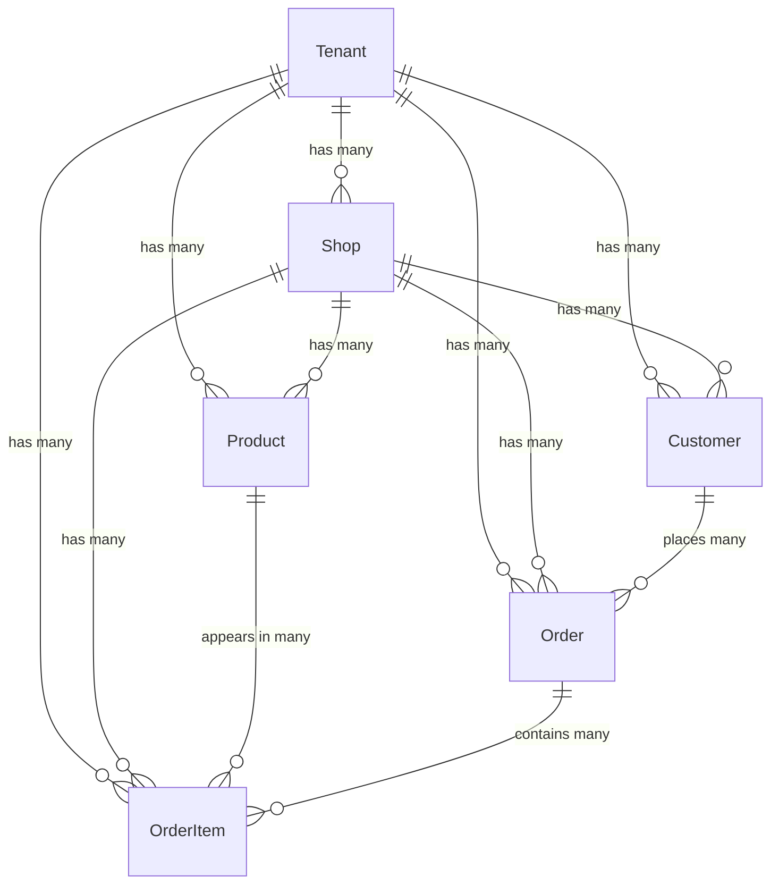

# Django Gyro Technical Design

## Overview

Django Gyro is a declarative system for importing CSV data into Django models. It provides a clean, validation-rich way to map CSV columns to Django model fields with automatic foreign key resolution.

## Example E-commerce SaaS Models

### Entity Relationship Diagram



### Django Model Definitions

Here are the Django models we'll use as examples throughout this documentation:

```python
# gyro_example/models.py
from django.db import models
from django.contrib.auth.models import User

class Tenant(models.Model):
    """Multi-tenant organization"""
    name = models.CharField(max_length=200)
    subdomain = models.CharField(max_length=50, unique=True)
    created_at = models.DateTimeField(auto_now_add=True)
    is_active = models.BooleanField(default=True)

class Shop(models.Model):
    """Individual shop within a tenant"""
    tenant = models.ForeignKey(Tenant, on_delete=models.CASCADE)
    name = models.CharField(max_length=200)
    url = models.URLField()
    currency = models.CharField(max_length=3, default='USD')
    created_at = models.DateTimeField(auto_now_add=True)

class Customer(models.Model):
    """Customer of a shop"""
    tenant = models.ForeignKey(Tenant, on_delete=models.CASCADE)
    shop = models.ForeignKey(Shop, on_delete=models.CASCADE)
    email = models.EmailField()
    first_name = models.CharField(max_length=100)
    last_name = models.CharField(max_length=100)
    phone = models.CharField(max_length=20, blank=True)
    created_at = models.DateTimeField(auto_now_add=True)

    class Meta:
        unique_together = ['shop', 'email']

class Product(models.Model):
    """Product in a shop"""
    tenant = models.ForeignKey(Tenant, on_delete=models.CASCADE)
    shop = models.ForeignKey(Shop, on_delete=models.CASCADE)
    sku = models.CharField(max_length=100)
    name = models.CharField(max_length=200)
    description = models.TextField(blank=True)
    price = models.DecimalField(max_digits=10, decimal_places=2)
    inventory_count = models.IntegerField(default=0)
    is_active = models.BooleanField(default=True)
    created_at = models.DateTimeField(auto_now_add=True)

    class Meta:
        unique_together = ['shop', 'sku']

class Order(models.Model):
    """Customer order"""
    STATUS_CHOICES = [
        ('pending', 'Pending'),
        ('processing', 'Processing'),
        ('shipped', 'Shipped'),
        ('delivered', 'Delivered'),
        ('cancelled', 'Cancelled'),
    ]

    tenant = models.ForeignKey(Tenant, on_delete=models.CASCADE)
    shop = models.ForeignKey(Shop, on_delete=models.CASCADE)
    customer = models.ForeignKey(Customer, on_delete=models.CASCADE)
    order_number = models.CharField(max_length=50)
    status = models.CharField(max_length=20, choices=STATUS_CHOICES, default='pending')
    total_amount = models.DecimalField(max_digits=10, decimal_places=2)
    tax_amount = models.DecimalField(max_digits=10, decimal_places=2, default=0)
    shipping_amount = models.DecimalField(max_digits=10, decimal_places=2, default=0)
    created_at = models.DateTimeField(auto_now_add=True)

    class Meta:
        unique_together = ['shop', 'order_number']

class OrderItem(models.Model):
    """Individual item within an order"""
    tenant = models.ForeignKey(Tenant, on_delete=models.CASCADE)
    shop = models.ForeignKey(Shop, on_delete=models.CASCADE)
    order = models.ForeignKey(Order, on_delete=models.CASCADE, related_name='items')
    product = models.ForeignKey(Product, on_delete=models.CASCADE)
    quantity = models.IntegerField()
    unit_price = models.DecimalField(max_digits=10, decimal_places=2)
    total_price = models.DecimalField(max_digits=10, decimal_places=2)
```

### Highlights:
Notice the following:
- You have a `Tenant` - this is the SaaS customer
- A tenant can have many `Shop`s
- A shop can have many `Product`s
- A shop can have many `Customer`s
- A customer can have many `Order`s

## How Data Slicer Works

### 1. Basic Importer Declaration
Every class that you want the Importer to know about
need to have an `Importer` definition like this:

```python
# gyro_example/importers.py

# You can place this anywhere, but its needed to run the
# import / exports later.

from django_gyro import Importer
from gyro_example.models import Tenant, Site, Customer, Order, OrderItem

class TenantImporter(Importer):
    model = Tenant

    class Columns:
        pass

class SiteImporter(Importer):
    model = Site

    class Columns:
        tenant = Tenant

class CustomerImporter(Importer):
    model = Customer

    class Columns:
        site = Site

class OrderImporter(Importer)

    class Columns:
        tenant = Tenant
        site = Site
        customer = Customer

# [any missing classes]

```

Notice that `SiteImporter`'s Columns definition only has the important foreign-key relationships `tenant = Site`.

The data_slicer.Importer when it runs later will validate that there is indeed a `tenant` ForeignKey on Site,
and it will also make sure there was a TenantImporter definition for Tenant. Additionally, it will validate
that there are not two Importer definitions for the same model. This is because at run-time, as we will see
in later examples, you can use the Importer.run command to define an ImportJob, which will need to be able
to find the referenced models' Importer classes from the `data_slicer` registry.


# Running the data slicer:

So now picture that you have your e-commerce project models, you have your importer definitions; your
`TenantImporter`, `SiteImporter`, `CustomerImporter`, `ProductImporter`, `OrderImporter`.

Next, you would want to be able to generate a postgres query that would be able to sample the data
and export it to csv.

The key to the sampling the data is this:
- For some relationships, you may not want to sample; you may want for instance a specific tenant and shop
- For other relationships, such as Product, you may want all the records
- For some records, such as `Customer`, you may want to limit max 100 records
- For the descendent related `Order` records, you may only want max 10 per customer
- But for the related `OrderItem` records, maybe you want all of them

Lets say you could express what you want to export in a syntax like this:

```python
from django_gyro import DataSlicer, ImportJob
from gyro_example.importers import Tenant, Site, Customer, Product, Order, OrderItem

tenant = Tenant.objects.filter(id=1)
sites = Site.objects.filter(tenant=tenant, id__in=[10, 11, 12])
products = Product.objects.filter(site__in=sites, tenant=tenant)
customers = Customer.objects.filter(site__in=sites)
orders = Order.objects.filter(customer__in=customers)
order_items = OrderItem.objects.filter(tenant=tenant, customer__in=customers)

postgres_url = ... # A bastion postgres url

import_jobs = DataSlicer.run(
    source=DataSlicer.Postgres(postgres_url),
    target=DataSlicer.File(
       '/mnt/data/dev-qa-org-1',
    ),
    jobs=[
      ImportJob(model=Tenant, query=tenant),
      ImportJob(model=Site, query=sites),
      ImportJob(model=Product, query=products),
      ImportJob(model=Customer, query=customers),
      ImportJob(model=Order, query=orders),
      ImportJob(model=OrderItem, query=order_items),
    ],
)
```

First of all, notice that we are importing the DataSlicer class and calling `.run` on it,
which kicks off a sort of ETL-like process between a `source` and a `target`. It is important
to point out that the entire block of code above is designed to be run in a note-book.

The other thing that stands out is that we have some Django ORM queries at the very top;
these are expressing which data we want to extract.

When diving deeper into the `.run` method, we see that the first parameter is `source`
and it is followed by a Postgres reference to a `postgres_url` string. This is where we will
be copying the data from. It is important to point out that no matter what the target is,
DataSlicer will always store exported data on disk as an intermediary step.

The second parameter is the `target` destination in this case, and we can see that it is
a FileTarget, which is pointing to your `/mnt/data/` directory which the DataSlicer can verify
is accessible to your notebook; if the files already exist, it will not download any files
and it should prompt the user to pass in the `overwrite=True` parameter to the `FileTarget`
class.

## Data export under the hood:
Internally, when you call `.run`, the DataSlicer class looks at each ImportJob, which
and it will look up that the `model` has a defined importer inside the `mystore_importer`
module.

The `.run` command may validate that the jobs are in the correct order; e.g. Tenant is
a field of almost all other Importer classes, so we can't place that one in the end.

Then, for each ImportJob, internally it will call .run() with a reference to the DataSlicer
run arguments. The basic structure of this command is something like this:

```python
def run(self, source, target):
    importer = self.get_importer(self.model)
    if isinstance(source, DataSlicer.Postgres):
        file = self.download_file(self.query, importer.file_name)

    file = source.read_data(importer.file_name)

    if isinstance(target, DataSlicer.Postgres):
        source.write_data(file)

```

Internally, the `.download_file` command uses the Django query to simply do equivalent of
`sql_query = str(self.query.query)` this will query from django without executing it yet,
and then it will construct a proper `COPY (your query)  TO STDOOUT WITH (FORMAT CSV, HEADER)`
command which gets executed by the `psycopg2.cursor.copy_expert(sql_query, file_buffer)`
function against the database_url that was passed into the `DataSlicer.Postgres` function.

To elaborate a little bit more, the resulting copy statements would be _conceptually_
equivalent to this, except its of course going to STDOUT and getting written to disk:

```
  COPY (SELECT * FROM accounts_tenant WHERE id = 1) TO '/tmp/accounts_tenant.csv' WITH (FORMAT CSV, HEADER);
```

```
  COPY (SELECT * FROM accounts_site WHERE tenant_id = 1 AND site_id in (10, 11, 12)) TO '/tmp/accounts_site.csv' WITH (FORMAT CSV, HEADER);
```

```
  COPY (
    SELECT * FROM products_product
    WHERE
      tenant_id = 1 AND
      site_id IN (
        10, 11, 12
      )
    ) TO '/tmp/products_product.csv' WITH (FORMAT CSV, HEADER);
```

```
  COPY (
    SELECT
        *
    FROM
        accounts_customer
    WHERE
        tenant_id = 1
        AND site_id IN (10, 11, 12)
    ) TO '/tmp/accounts_customer.csv' WITH (FORMAT CSV, HEADER);
```

```
  COPY (
    SELECT
        *
    FROM
        products_product
    WHERE
        tenant_id = 1
        AND site_id IN (10, 11, 12)
    ) TO '/tmp/products_product.csv' WITH (FORMAT CSV, HEADER);
```

```
  COPY (
    SELECT
        *
    FROM
        orders_order
    WHERE
        tenant_id = 1
        AND site_id IN (10, 11, 12)
    ) TO '/tmp/orders_order.csv' WITH (FORMAT CSV, HEADER);
```

```
  COPY (
    SELECT
        *
    FROM
        orders_orderitem
    WHERE
        tenant_id = 1
        AND site_id IN (10, 11, 12)
    ) TO '/tmp/orders_orderitem.csv' WITH (FORMAT CSV, HEADER);
```

While the command its running, the command should output tqdm.notebook.tqdm  progress bars to show
the progress while its downloading the files to the local environment.

It should be downloading each file sequentially in the order of the ImportJobs.
